# System Architecture

## Multi-Crew AI Learning Pipeline

```mermaid
flowchart TD
    %% Input Sources
    A[Meeting Transcripts] --> B{Crew 1: Meeting Documentation<br/>august_hackathon}
    A1[Additional Markdown<br/>Content] --> C{Crew 2: Learning Plan Creation<br/>onboarding_plan}
    
    %% Crew 1 Detailed Process
    B --> B_Agent[🤖 Meeting Transcript Analyst<br/>Senior Documentation Specialist]
    B_Agent --> B_Task[📋 Process Meeting Transcript<br/>• Extract comprehensive details<br/>• Preserve all conversational nuances<br/>• Create verbose markdown reports<br/>• Include quotes & technical context]
    B_Task --> B1[Structured Knowledge Capture Reports<br/>Title + ShortFileName metadata<br/>Minimum 1500 words per report]
    B1 --> B2[📁 /meeting_summaries/]
    
    %% Crew 2 Detailed Process
    B2 --> C_Agent1[🤖 Documentation Reader & Cataloger<br/>Technical Documentation Specialist]
    A1 --> C_Agent1
    C_Agent1 --> C_Task1[📋 Catalog Documentation Files<br/>• Read all markdown files<br/>• Extract titles & key topics<br/>• Assess complexity levels<br/>• Create comprehensive inventory]
    
    C_Task1 --> C_Agent2[🤖 Content Analyzer & Knowledge Mapper<br/>Educational Specialist & Curriculum Developer]
    C_Agent2 --> C_Task2[📋 Analyze Learning Content<br/>• Identify concept dependencies<br/>• Map knowledge relationships<br/>• Determine learning sequences<br/>• Create progression pathways]
    
    C_Task2 --> C_Agent3[🤖 Learning Plan Designer<br/>Senior Learning Experience Designer]
    C_Agent3 --> C_Task3[📋 Design Structured Learning Plan<br/>• Create separate modules<br/>• Define learning objectives<br/>• Set progression milestones<br/>• Include assessments & timeframes]
    C_Task3 --> C1[Comprehensive Onboarding Plan<br/>Modular learning structure<br/>Clear objectives & activities]
    C1 --> C2[📁 /meeting_subproject/<br/>onboarding_plan/]
    
    %% Crew 3 Detailed Process
    C2 --> D_Agent1[🤖 Learning Content Analyzer<br/>Educational Content Specialist]
    D_Agent1 --> D_Task1[📋 Analyze Learning Modules<br/>• Identify knowledge gaps<br/>• Find enrichment opportunities<br/>• Suggest additional content needs]
    
    D_Task1 --> D_Agent2[🤖 Research Specialist<br/>Academic & Information Science Background]
    D_Task1 --> D_Agent3[🤖 Advanced Search Researcher<br/>Specialized Academic Content Finder]
    
    D_Agent2 --> D_Task2[📋 Conduct General Research<br/>• Internet search via Serper<br/>• Find recent developments<br/>• Gather practical examples<br/>• Verify credible sources]
    
    D_Agent3 --> D_Task3[📋 Perform Advanced Research<br/>• Deep search using EXA<br/>• Find academic & technical content<br/>• Identify expert perspectives<br/>• Locate cutting-edge research]
    
    D_Task2 --> D_Agent4[🤖 Content Enrichment Writer<br/>Educational Content Writer & Designer]
    D_Task3 --> D_Agent4
    
    D_Agent4 --> D_Task4[📋 Create Enriched Content<br/>• Synthesize research findings<br/>• Integrate new information<br/>• Add proper citations<br/>• Maintain educational flow]
    
    D_Task4 --> D1[Enriched Learning Program<br/>Enhanced modules with context<br/>Citations & references<br/>Recent developments]
    D1 --> D4[📁 /meeting_subproject/<br/>web_research/]
    
    %% Frontend Display
    D4 --> E[MkDocs Frontend]
    E --> F[📖 Interactive Learning<br/>Documentation]
    
    %% Technology Stack
    subgraph "Technology Stack"
        G1[CrewAI Framework]
        G2[GPT-4o LLM]
        G3[Serper API]
        G4[Exa API]
        G5[MkDocs]
    end
    
    %% Styling
    classDef crewBox fill:#e1f5fe,stroke:#01579b,stroke-width:2px
    classDef agentBox fill:#fff9c4,stroke:#f57f17,stroke-width:2px
    classDef taskBox fill:#e8f5e8,stroke:#388e3c,stroke-width:2px
    classDef dataStore fill:#f3e5f5,stroke:#4a148c,stroke-width:2px
    classDef techStack fill:#fff3e0,stroke:#e65100,stroke-width:2px
    classDef frontend fill:#e8f5e8,stroke:#2e7d32,stroke-width:2px
    
    class B,C crewBox
    class B_Agent,C_Agent1,C_Agent2,C_Agent3,D_Agent1,D_Agent2,D_Agent3,D_Agent4 agentBox
    class B_Task,C_Task1,C_Task2,C_Task3,D_Task1,D_Task2,D_Task3,D_Task4 taskBox
    class B2,C2,D4 dataStore
    class G1,G2,G3,G4,G5 techStack
    class E,F frontend
```

## Detailed Workflow Description

### Crew 1: Meeting Documentation (august_hackathon)
**Location**: `/Users/johnney-fivemiller/CascadeProjects/windsurf-project/august_hackathon/`

#### Agent: Meeting Transcript Analyst
- **Role**: Senior Meeting Documentation Specialist & Comprehensive Analyst
- **Expertise**: Meticulous documentation, technical accuracy, conversational preservation
- **Philosophy**: Capture EVERY detail rather than summarize

#### Task: Process Meeting Transcript
- **Input**: Raw meeting transcripts from specified file paths
- **Process**: 
  - Extract ALL participant contributions with specific quotes
  - Document detailed discussion points with full context
  - Preserve technical discussions and background information
  - Include conversational nuances and exchanges
- **Output Requirements**:
  - Minimum 1500-word comprehensive markdown reports
  - Title and ShortFileName metadata for file organization
  - Structured with headers, subheaders, tables, and emphasis
  - Complete historical record of meetings

### Crew 2: Learning Plan Creation (onboarding_plan)
**Location**: `/Users/johnney-fivemiller/CascadeProjects/windsurf-project/meeting_subproject/onboarding_plan/`

#### Sequential Agent Workflow:

**Agent 1: Documentation Reader & Cataloger**
- **Role**: Technical documentation specialist for content inventory
- **Task**: Read all markdown files and create comprehensive catalog
- **Output**: Detailed inventory with titles, topics, concepts, and complexity levels

**Agent 2: Content Analyzer & Knowledge Mapper**  
- **Role**: Educational specialist and curriculum developer
- **Task**: Analyze cataloged content to identify learning pathways
- **Process**:
  - Map concept relationships and dependencies
  - Determine foundational vs. advanced topics
  - Create logical learning sequences
- **Output**: Knowledge map with progression pathways

**Agent 3: Learning Plan Designer**
- **Role**: Senior learning experience designer (10+ years experience)
- **Task**: Transform analysis into structured onboarding plan
- **Process**:
  - Design separate learning modules
  - Define clear objectives and activities
  - Set progression milestones and success criteria
  - Include timeframes and prerequisites
- **Output**: Complete modular onboarding plan with assessment strategy

### Crew 3: Content Enrichment (web_research)
**Location**: `/Users/johnney-fivemiller/CascadeProjects/windsurf-project/meeting_subproject/web_research/`

#### Multi-Agent Research & Enrichment:

**Agent 1: Learning Content Analyzer**
- **Role**: Educational content specialist with curriculum expertise
- **Task**: Identify gaps and enrichment opportunities in existing modules

**Agent 2: Research Specialist** (Parallel)
- **Role**: Academic researcher with information science background
- **Task**: Conduct comprehensive internet research via Serper API
- **Focus**: Recent developments, practical examples, credible sources

**Agent 3: Advanced Search Researcher** (Parallel)
- **Role**: Specialized academic content finder
- **Task**: Deep research using EXA API for academic/technical content
- **Focus**: Expert perspectives, cutting-edge research, specialized knowledge

**Agent 4: Content Enrichment Writer**
- **Role**: Educational content writer and instructional designer
- **Task**: Synthesize all research findings into enriched content
- **Process**:
  - Integrate new information seamlessly
  - Add proper citations and references
  - Maintain educational flow and coherence
- **Output**: Complete enriched learning program with citations

## Key Technologies
- **CrewAI**: Multi-agent orchestration framework
- **GPT-4o**: Large language model for content generation
- **Serper**: Web search API for real-time information
- **Exa**: Content discovery and curation API
- **MkDocs**: Documentation site generator